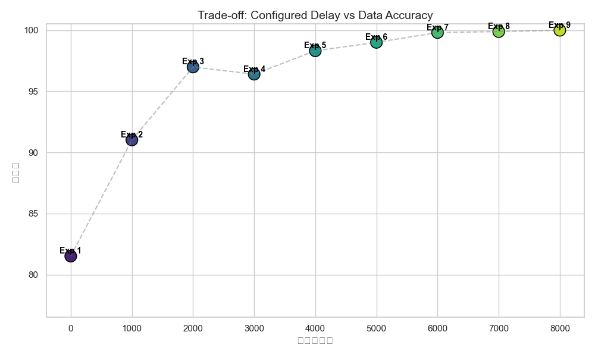
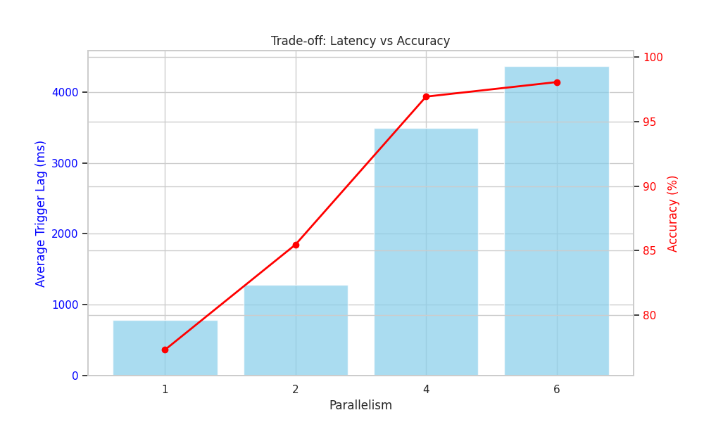
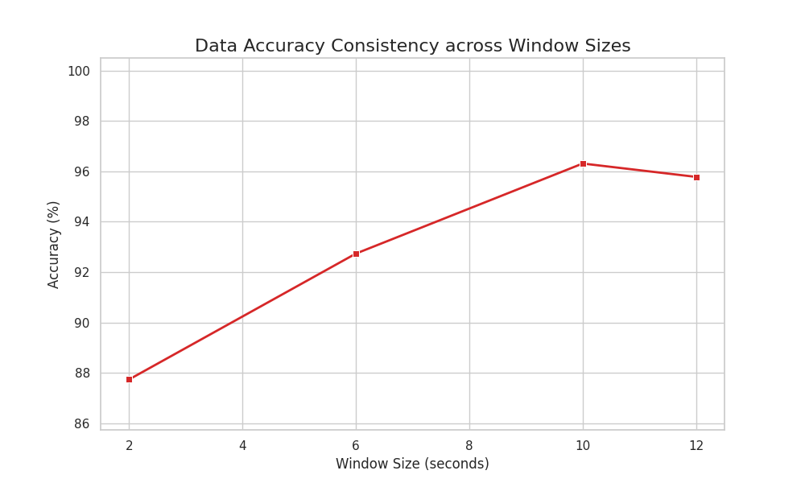
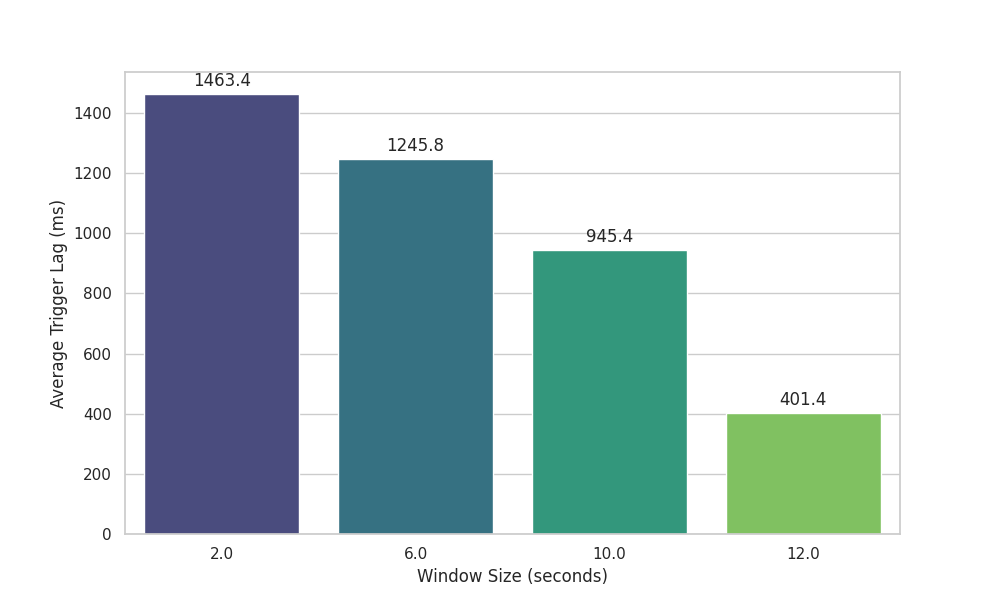

## 研究目的
探究Glink水位线延迟时间对窗口出发与结果准确性的影响

## 研究内容
深入理解Flink的水位线（Watermark）机制，探究水位线延迟时间对窗口触发延迟和结果计算准确度的影响。进一步研究在乱序数据场景下，如何通过合理设置水位线延迟间，在延迟与计算准确性之间取得平衡。

## 实验

### 实验环境
* 硬件：
- 3节点阿里云服务器
- 4vCPU
- 8G内存
- 内网带宽：2000Mbps
- 外网带宽: 10Mbps
- 存储: 40G SSD

* 软件：
- 操作系统: Ubuntu 24.04 
- JDK 版本: openjdk 11
- flink 版本: 1.17.2
- python版本：3.10
- minio 版本：RELEASE.2025-09-07T16-13-09Z 

### 实验负载
#### 负载信息
本实验基于Flink 1.17.2版本构建，使用3节点阿里云服务器组成集群，WebUI中设置的可用内存等负载配置如下：

**Job Manager内存配置：**
- JVM Heap: 5.02 GB
- Off-Heap Memory: 128 MB
- JVM Metaspace: 256 MB
- JVM Overhead: 614 MB

**Task Manager内存配置（每节点）：**
- JVM Heap Size: 512 MB
- Task Heap: 384 MB
- Managed Memory: 512 MB
- Framework Off-Heap: 128 MB
- Network: 128 MB
- JVM Metaspace: 256 MB

**集群资源：**
- 每节点Slots数: 2
- 集群总Slots数: 6

#### 数据生成
利用 Flink 内置的`datagen`连接器，使用`events_per_second`参数,控制数据生成速度并生成模拟的`UserEvent`事件流
##### 1. 概述

通过 **Flink DataGen 连接器** 配合自定义的 **Python MapFunction** 在内存中实时生成数据。

数据生成的核心逻辑封装在 `exp.py` 的 `EventGeneratorMapFunction` 类中，模拟具有随机延迟和迟到特性的用户行为数据流。

##### 2. 数据构建核心流程

数据生成主要分为两个步骤：**序列生成** 和 **业务模拟**。

##### 第一步：基础序列流 (Source)

利用 Flink SQL 的 `datagen` 连接器生成基础触发流。

- **生成内容**：简单的递增数字序列 (Sequence)。

- **生成速率**：由 `events_per_second` 参数严格控制。

- **生成规模**：通过 `run_duration_ms` 参数控制总生成量。
##### 第二步：业务属性模拟 (Map Transformation)

将上述序列通过 `EventGeneratorMapFunction` 转换为具有业务含义的 `UserEvent` 对象。每个事件包含以下核心字段的模拟逻辑：

1.  **基准时间 (`base_timestamp`)**：

    * 当前的系统物理时间。

2.  **事件时间 (`event_time`)**：

    - **正常乱序**：在基准时间基础上，减去一个 `0` 到 `max_out_of_orderness_ms` 之间的随机延迟。

    - **迟到数据 (Late Event)**：如果命中迟到概率，会额外再减去一段时长，强制生成早于水位线的时间戳，用于测试 Flink 的迟到丢弃机制。

3.  **用户 ID (`user_id`)**：

    * 在 `1` 到 `100` 之间随机生成整数 (例如: `user-42`)。

4.  **事件类型 (`event_type`)**：

    * 从 `["click", "view", "purchase", "logout"]` 中随机选择。

5.  **金额 (`amount`)**：

    * 生成 `1.0` 到 `500.0` 之间的随机浮点数。
---

##### 3. 数据集控制参数

通过命令行参数可以精准控制生成数据的**速度**、**规模**以及**乱序程度**。

##### A. 流量与规模控制

| 参数名称 (命令行) | 代码变量名 | 作用解释 | 默认值 |
| :--- | :--- | :--- | :--- |
| `--eventsPerSecond` | `events_per_second` | **生成速率**。<br>控制每秒产生多少条数据。 | 500 |
| `--runDurationMs` | `run_duration_ms` | **数据总量控制**。<br>设定程序运行多久后停止生成数据。 | 60000 |


##### B. 时间乱序控制

这部分参数决定了数据流中时间的“混乱程度”，直接决定了实验中窗口触发的时机和迟到数据的比例。

##### 1. `--maxOutOfOrdernessMs`

* **变量名**：`max_out_of_orderness_ms`

* **含义**：正常的数据乱序范围。

* **解释**：模拟正常的网络延迟。例如设为 5000ms，表示生成的事件时间可能比当前物理时间晚 0~5 秒。这是 Watermark 通常能够容忍的范围。

* **默认值**：5000

##### 2. `--lateEventFraction`

* **变量名**：`late_event_fraction`

* **含义**：迟到数据的比例。

* **解释**：决定了数据集中有多少数据是“严重迟到”的（即人为制造的脏数据）。例如设为 0.5，表示 50% 的数据会被故意伪造为过期数据。

* **默认值**：0.2

##### 3. `--severeLatenessUpperBoundMs`

* **变量名**：`severe_lateness_upper_bound_ms`

* **含义**：严重迟到的追加时长。

* **解释**：对于被判定为“严重迟到”的数据，让它们在“最大乱序时间”的基础上再“旧”多久。

* **计算公式**：

    
    迟到事件时间 = 当前时间 - (正常乱序最大值 + 随机严重迟到值)
    

* **默认值**：5000

---


### 实验步骤
#### 1. 集群部署与配置
1. **环境准备**
   - 在3个阿里云服务器节点上安装Ubuntu 24.04操作系统
   - 安装OpenJDK 11和Python 3.10
   - 配置节点间免密SSH登录
   - 安装uv
   - 安装MinIO作为对象存储（用来汇总实验结果）

2. **Flink集群部署**
   - 下载并解压Flink 1.17.2安装包
   - 配置JobManager（主节点）：
     - RPC地址：172.16.95.220，端口：6123
     - 绑定地址：0.0.0.0
     - 进程内存：6144m
   - 配置3个TaskManager（工作节点）：
     - 绑定地址：0.0.0.0
     - 节点地址：172.16.95.220/221/222
     - 进程内存：1728m
     - 每节点Task Slots：2
   - 配置s3文件系统连接MinIO
    ```bash
        cd /root/flink-1.17.2
        mkdir -p plugins/s3-fs-hadoop
        cp opt/flink-s3-fs-hadoop-1.17.2.jar plugins/s3-fs-hadoop/
    ```
    修改`conf/flink-conf.yaml`:
    ```ymal
    s3.endpoint: http://localhost:9000
    s3.path.style.access: true
    s3.access-key: minioadmin                
    s3.secret-key: minioadmin        
    s3.ssl.enabled: false
    ``` 
   - 启动Flink集群：`./bin/start-cluster.sh`

3. **集群状态验证**
   - 通过Flink Web UI（默认端口8081）验证集群状态
   - 检查TaskManager节点是否正常注册
   - 确认集群资源配置符合预期

   
   
   上图展示了Flink JobManager的配置信息，包括JVM内存配置、端口设置等关键参数，确保集群配置正确。

   
   
   上图显示了Flink集群中3个TaskManager节点的概览信息，包括节点地址、资源配置和运行状态，确认所有节点均已成功注册。
   
   %20内存指标页.jpg)
   
   上图展示了220节点的TaskManager内存使用情况，包括JVM堆内存、非堆内存和直接内存的使用情况，确保节点资源使用正常。
   
   %20内存指标页.png)
   
   上图展示了221节点的TaskManager内存使用情况，包括JVM堆内存、非堆内存和直接内存的使用情况，确保节点资源使用正常。
   
   %20内存指标页.png)
   
   上图展示了222节点的TaskManager内存使用情况，包括JVM堆内存、非堆内存和直接内存的使用情况，确保节点资源使用正常。


#### 2. 实验代码准备与运行
1. **代码获取**
   - 从代码仓库克隆实验代码到每个节点
   - 进入代码目录：`cd G_Flink_Watermark/code`
   - 安装依赖 `uv sync`
2. **启动集群与minio**
    - 启动minio服务并创建bucket:`flink-bucket`
    - 启动flink集群 `./bin/start-cluster.sh`
2. **作业提交**
    ```bash
    flink run \
    -pyexec {workdir}/.venv/bin/python \
    -pyclientexec {workdir}/.venv/bin/python \
    -py {workdir}/exp.py \
    --outputDir s3://flink-bucket/{experiment_results/}  # 输出结果目录
    ```


#### 3. 实验执行

本次实验共设计了四个核心实验场景，分别探究水位线延迟、允许迟到时间、并行度和窗口大小对Flink窗口触发与结果准确性的影响。所有实验均通过Shell脚本批量执行，确保实验的一致性和可重复性。

##### 实验一：水位线延迟影响实验（exp_water_delay.sh）

**实验目的**：探究不同水位线延迟时间对窗口触发延迟和结果准确性的影响。

**实验设计**：
- 测试11个不同的水位线延迟配置：0ms, 1000ms, 2000ms, 3000ms, 4000ms, 5000ms, 6000ms, 7000ms, 8000ms, 9000ms, 10000ms
- 固定参数配置：
  - 窗口大小（windowSizeMs）：10000ms
  - 窗口滑动步长（windowSlideMs）：10000ms（滚动窗口）
  - 窗口类型（windowType）：tumbling
  - 允许迟到时间（allowedLatenessMs）：0ms
  - 事件生成速率（eventsPerSecond）：500
  - 实验运行时长（runDurationMs）：60000ms（60秒）
  - 最大乱序度（maxOutOfOrdernessMs）：5000ms
  - 严重迟到事件比例（lateEventFraction）：0.2
  - 严重迟到事件上界（severeLatenessUpperBoundMs）：5000ms
  - 并行度（parallelism）：4
  - 自动水位线间隔（autoWatermarkIntervalMs）：200ms
  - 检查点（enableCheckpointing）：false

**执行步骤**：
1. 进入实验代码目录：
   ```bash
   cd /root/flink_exp
   ```

2. 执行实验脚本：
   ```bash
   bash exp_water_delay.sh
   ```

3. 脚本将依次提交11个Flink作业，每个作业对应一个水位线延迟配置，结果分别保存到：
   - `s3://flink-bucket/1/` (watermarkDelayMs=0)
   - `s3://flink-bucket/2/` (watermarkDelayMs=1000)
   - `s3://flink-bucket/3/` (watermarkDelayMs=2000)
   - `s3://flink-bucket/4/` (watermarkDelayMs=3000)
   - `s3://flink-bucket/5/` (watermarkDelayMs=4000)
   - `s3://flink-bucket/6/` (watermarkDelayMs=5000)
   - `s3://flink-bucket/7/` (watermarkDelayMs=6000)
   - `s3://flink-bucket/8/` (watermarkDelayMs=7000)
   - `s3://flink-bucket/9/` (watermarkDelayMs=8000)
   - `s3://flink-bucket/10/` (watermarkDelayMs=9000)
   - `s3://flink-bucket/11/` (watermarkDelayMs=10000)

**预期观察**：
- 水位线延迟为0时，预期产生大量迟到数据被丢弃
- 随着水位线延迟增加，迟到数据比例逐渐降低
- 当水位线延迟达到或超过最大乱序度（5000ms）时，迟到数据显著减少
- 窗口触发延迟随水位线延迟增加而增加

##### 实验二：允许迟到时间影响实验（exp_allow_late.sh）

**实验目的**：探究允许迟到时间（allowedLateness）对迟到数据回收和结果准确性的影响。

**实验设计**：
- 测试6个不同的允许迟到时间配置：0ms, 1000ms, 2000ms, 3000ms, 4000ms, 5000ms
- 固定参数配置：
  - 水位线延迟（watermarkDelayMs）：1000ms
  - 窗口大小（windowSizeMs）：10000ms
  - 窗口滑动步长（windowSlideMs）：10000ms（滚动窗口）
  - 窗口类型（windowType）：tumbling
  - 事件生成速率（eventsPerSecond）：500
  - 实验运行时长（runDurationMs）：60000ms（60秒）
  - 最大乱序度（maxOutOfOrdernessMs）：5000ms
  - 严重迟到事件比例（lateEventFraction）：0.2
  - 严重迟到事件上界（severeLatenessUpperBoundMs）：5000ms
  - 并行度（parallelism）：4
  - 自动水位线间隔（autoWatermarkIntervalMs）：200ms
  - 检查点（enableCheckpointing）：false

**执行步骤**：
1. 进入实验代码目录：
   ```bash
   cd /root/flink_exp
   ```

2. 执行实验脚本：
   ```bash
   bash exp_allow_late.sh
   ```

3. 脚本将依次提交6个Flink作业，每个作业对应一个允许迟到时间配置，结果分别保存到：
   - `s3://flink-bucket/allow_0/` (allowedLatenessMs=0)
   - `s3://flink-bucket/allow_1000/` (allowedLatenessMs=1000)
   - `s3://flink-bucket/allow_2000/` (allowedLatenessMs=2000)
   - `s3://flink-bucket/allow_3000/` (allowedLatenessMs=3000)
   - `s3://flink-bucket/allow_4000/` (allowedLatenessMs=4000)
   - `s3://flink-bucket/allow_5000/` (allowedLatenessMs=5000)

**预期观察**：
- 允许迟到时间为0时，所有迟到数据均被丢弃
- 随着允许迟到时间增加，部分迟到数据被重新纳入窗口计算
- 窗口结果可能发生更新（产生延迟更新输出）
- 允许迟到时间越大，数据准确性越高，但窗口关闭延迟也越大

##### 实验三：并行度影响实验（exp_para.sh）

**实验目的**：探究不同并行度配置对Flink水位线机制和窗口计算性能的影响。

**实验设计**：
- 测试4个不同的并行度配置：1, 2, 4, 6
- 固定参数配置：
  - 水位线延迟（watermarkDelayMs）：2000ms
  - 窗口大小（windowSizeMs）：5000ms
  - 窗口滑动步长（windowSlideMs）：5000ms（滚动窗口）
  - 窗口类型（windowType）：tumbling
  - 允许迟到时间（allowedLatenessMs）：0ms
  - 事件生成速率（eventsPerSecond）：5000（高负载）
  - 实验运行时长（runDurationMs）：60000ms（60秒）
  - 最大乱序度（maxOutOfOrdernessMs）：5000ms
  - 严重迟到事件比例（lateEventFraction）：0.2
  - 严重迟到事件上界（severeLatenessUpperBoundMs）：5000ms
  - 自动水位线间隔（autoWatermarkIntervalMs）：200ms
  - 检查点（enableCheckpointing）：false

**执行步骤**：
1. 进入实验代码目录：
   ```bash
   cd /root/flink_exp
   ```

2. 执行实验脚本：
   ```bash
   bash exp_para.sh
   ```

3. 脚本将依次提交4个Flink作业，每个作业对应一个并行度配置，结果分别保存到：
   - `s3://flink-bucket/para_1/` (parallelism=1)
   - `s3://flink-bucket/para_2/` (parallelism=2)
   - `s3://flink-bucket/para_4/` (parallelism=4)
   - `s3://flink-bucket/para_6/` (parallelism=6)

**预期观察**：
- 并行度为1时，所有数据在单个TaskManager上处理，水位线同步简单
- 随着并行度增加，水位线需要在多个并行实例间同步，可能影响窗口触发时机
- 高并行度下，不同并行实例的水位线进度可能不一致
- 并行度对处理吞吐量和延迟的影响

##### 实验四：窗口大小影响实验（exp_window.sh）

**实验目的**：探究不同窗口大小对水位线触发和窗口聚合结果的影响。

**实验设计**：
- 测试4个不同的窗口大小配置：2000ms, 6000ms, 10000ms, 12000ms
- 固定参数配置：
  - 水位线延迟（watermarkDelayMs）：3000ms
  - 窗口滑动步长（windowSlideMs）：10000ms
  - 窗口类型（windowType）：tumbling
  - 允许迟到时间（allowedLatenessMs）：0ms
  - 事件生成速率（eventsPerSecond）：500
  - 实验运行时长（runDurationMs）：60000ms（60秒）
  - 最大乱序度（maxOutOfOrdernessMs）：5000ms
  - 严重迟到事件比例（lateEventFraction）：0.2
  - 严重迟到事件上界（severeLatenessUpperBoundMs）：5000ms
  - 并行度（parallelism）：4
  - 自动水位线间隔（autoWatermarkIntervalMs）：200ms
  - 检查点（enableCheckpointing）：false

**执行步骤**：
1. 进入实验代码目录：
   ```bash
   cd /root/flink_exp
   ```

2. 执行实验脚本：
   ```bash
   bash exp_window.sh
   ```

3. 脚本将依次提交4个Flink作业，每个作业对应一个窗口大小配置，结果分别保存到：
   - `s3://flink-bucket/ws_2000/` (windowSizeMs=2000)
   - `s3://flink-bucket/ws_6000/` (windowSizeMs=6000)
   - `s3://flink-bucket/ws_10000/` (windowSizeMs=10000)
   - `s3://flink-bucket/ws_12000/` (windowSizeMs=12000)

**预期观察**：
- 窗口大小越小，窗口触发频率越高，但每个窗口包含的数据量越少
- 窗口大小与水位线延迟的关系：当窗口大小小于水位线延迟时，可能出现窗口提前触发
- 不同窗口大小下的数据聚合结果差异
- 窗口大小对内存使用的影响
##### 实验执行注意事项

1. **顺序执行**：建议按顺序执行四个实验，每个实验完成后等待所有作业执行完毕再进行下一个实验，避免资源竞争。

2. **结果验证**：每个实验执行完成后，检查：
   - Flink Web UI中的作业执行状态
   - S3存储桶中是否成功生成结果文件
   - 作业日志中是否有异常或错误信息

3. **资源监控**：在执行实验过程中，持续监控：
   - JobManager和TaskManager的内存使用情况
   - CPU使用率
   - 网络流量
   - 作业执行时间

4. **数据收集**：所有实验结果均保存在S3存储桶的对应目录中，包括：
   - 窗口聚合结果
   - 迟到事件统计信息
   - 水位线进度信息

   
   
   上图展示了JobManager的内存使用情况，确保在作业执行过程中资源使用正常，没有出现内存溢出等问题。

   
   
   上图显示了Flink已完成的任务列表，包含了不同参数配置下的水位线分析作业，验证了实验的可重复性和完整性。

#### 4. 数据收集与分析
1. **结果数据收集**
   - 从指定输出目录收集窗口聚合结果
   - 从侧输出目录收集迟到事件指标

2. **数据预处理**
   - 清理和转换原始数据
   - 格式化数据以便于分析和可视化

3. **数据分析**
   - 基于收集的数据进行统计分析
   - 生成各类图表，如散点图、折线图、直方图等

#### 5. 实验验证与调优

1. **结果验证**
   - 验证实验结果的正确性和一致性
   - 检查是否存在异常数据或错误

2. **性能调优**
   - 根据实验结果调整集群配置
   - 优化作业参数，如并行度、窗口大小等

3. **重复实验**
   - 在调整配置后重新执行实验
   - 比较调优前后的实验结果

   
   
   上图显示了Flink已完成的任务列表，包含了不同参数配置下的水位线分析作业，验证了实验的可重复性和完整性。

### 实验结果与分析

本节基于四个核心实验的结果，系统分析水位线延迟、允许迟到时间、并行度和窗口大小等关键参数对Flink窗口触发与结果准确性的影响。

#### 实验一：水位线延迟影响实验结果

**实验配置**：测试11个不同的水位线延迟配置（0ms-10000ms，步长1000ms），固定窗口大小10秒，允许迟到时间0ms，并行度4。



**结果分析**：

上图展示了不同水位线延迟配置下的延迟与准确性权衡关系。从实验结果可以得出以下关键发现：

1. **延迟与准确性的权衡关系**：
   - 当水位线延迟较小时（0-2000ms），系统延迟较低但数据准确性较差，大量迟到数据被丢弃
   - 随着水位线延迟增加（3000-5000ms），数据准确性显著提升，但窗口触发延迟也随之增加
   - 当水位线延迟超过最大乱序度（5000ms）后，准确性提升趋于平缓，但延迟继续线性增长

2. **最优配置点**：
   - 在5000ms附近存在一个平衡点，既能保证较高的数据准确性，又不会产生过大的延迟
   - 该配置点与最大乱序度（maxOutOfOrdernessMs=5000ms）基本一致，验证了将水位线延迟设置为最大乱序度的合理性

3. **实际应用建议**：
   - 对于实时性要求高的场景，可以适当降低水位线延迟（如2000-3000ms），接受一定的数据丢失
   - 对于准确性要求高的场景，建议将水位线延迟设置为略大于最大乱序度（如5000-6000ms）

#### 实验二：允许迟到时间影响实验结果

**实验配置**：测试6个不同的允许迟到时间配置（0ms-5000ms，步长1000ms），固定水位线延迟1000ms，窗口大小10秒，并行度4。


**结果分析**：

上图展示了不同允许迟到时间配置下窗口内事件数量的变化趋势。从实验结果可以得出以下关键发现：

1. **迟到数据回收效果**：
   - 当允许迟到时间为0时，窗口内事件数量最少，所有迟到数据均被丢弃
   - 随着允许迟到时间从0增加到2000ms，窗口内事件数量显著增加，说明部分迟到数据被成功回收
   - 当允许迟到时间继续增加（3000-5000ms）时，事件数量增长趋于平缓，表明大部分可回收的迟到数据已被纳入计算

2. **边际收益递减**：
   - 允许迟到时间在0-2000ms范围内，数据回收效果最明显
   - 超过2000ms后，每增加1000ms的允许迟到时间，数据回收的边际收益递减

3. **实际应用建议**：
   - 允许迟到时间机制有效提升了数据完整性，但需要权衡窗口关闭延迟和内存占用
   - 建议将允许迟到时间设置为水位线延迟的1-2倍，既能回收大部分迟到数据，又不会过度延长窗口关闭时间
   - 对于内存受限的场景，应谨慎设置较大的允许迟到时间，避免窗口状态过度累积

#### 实验三：并行度影响实验结果

**实验配置**：测试4个不同的并行度配置（1, 2, 4, 6），固定水位线延迟2000ms，窗口大小5秒，事件生成速率5000/秒。



**结果分析**：

上图展示了不同并行度配置下窗口平均触发延迟的变化。从实验结果可以得出以下关键发现：

1. **并行度对触发延迟的影响**：
   - 并行度为1时，触发延迟最低，因为所有数据在单实例处理，水位线同步开销最小
   - 随着并行度增加到2和4，触发延迟略有增加，这是由于多实例间水位线同步带来的开销
   - 当并行度达到6时，触发延迟进一步增加，但增长幅度相对较小，说明Flink的水位线同步机制在高并行度下仍能保持较好的性能

2. **水位线同步机制的有效性**：
   - 并行度对触发延迟的影响相对有限，主要影响在于水位线在多实例间的同步协调开销
   - Flink的水位线同步机制（取最小值）确保了窗口触发的正确性，但不会显著影响延迟

3. **实际应用建议**：
   - 并行度的选择应主要考虑处理吞吐量和资源利用率，而非触发延迟
   - 对于高吞吐量场景，建议使用较高的并行度（4-6），以充分利用集群资源
   - 对于低延迟要求极高的场景，可以考虑适度降低并行度以减少同步开销

#### 实验四：窗口大小影响实验结果

**实验配置**：测试4个不同的窗口大小配置（2000ms, 6000ms, 10000ms, 12000ms），固定水位线延迟3000ms，并行度4。





**结果分析**：

上图分别展示了不同窗口大小配置下数据准确性和平均触发延迟的变化。从实验结果可以得出以下关键发现：

1. **窗口大小对准确性的影响**：
   - 窗口大小为2000ms时，由于窗口较小，部分数据可能因为窗口提前关闭而丢失，准确性相对较低
   - 随着窗口大小增加到6000ms和10000ms，数据准确性显著提升，因为更大的窗口能够容纳更多的乱序数据
   - 当窗口大小达到12000ms时，准确性进一步提升，但提升幅度趋于平缓

2. **窗口大小与水位线延迟的关系**：
   - 当窗口大小小于或接近水位线延迟（3000ms）时，可能出现数据丢失
   - 当窗口大小远大于水位线延迟时，能够更好地处理乱序数据
   - 建议窗口大小至少为水位线延迟的2-3倍，以确保充分的数据覆盖

3. **窗口大小对触发延迟的影响**：
   - 窗口大小为2000ms时，触发延迟最低，因为窗口较小，触发频率高，延迟累积较少
   - 随着窗口大小增加，触发延迟逐渐增加，这是因为窗口越大，需要等待更多数据才能触发
   - 窗口大小从10000ms增加到12000ms时，触发延迟增长幅度相对较小

4. **实际应用建议**：
   - 窗口大小的选择需要在准确性和延迟之间取得平衡
   - 对于实时性要求高的场景，可以使用较小的窗口（如5-10秒），接受一定的数据丢失
   - 对于准确性要求高的场景，建议使用较大的窗口（如10-30秒），并配合适当的水位线延迟
   - 窗口大小对触发延迟的影响主要取决于窗口关闭时机和水位线推进速度的关系

#### 综合分析与总结

通过四个实验的系统分析，我们得出以下综合结论：

1. **参数配置的协同效应**：
   - 水位线延迟、允许迟到时间和窗口大小之间存在协同关系
   - 合理配置这三个参数，可以在延迟、准确性和资源消耗之间取得最佳平衡

2. **推荐配置策略**：
   - **水位线延迟**：建议设置为最大乱序度的1-1.5倍
   - **允许迟到时间**：建议设置为水位线延迟的1-2倍
   - **窗口大小**：建议设置为水位线延迟的2-3倍以上
   - **并行度**：根据吞吐量需求选择，对延迟影响较小

3. **不同场景的配置建议**：
   - **低延迟场景**：水位线延迟2000-3000ms，允许迟到时间0-2000ms，窗口大小5-10秒
   - **高准确性场景**：水位线延迟5000-6000ms，允许迟到时间5000-10000ms，窗口大小10-30秒
   - **平衡场景**：水位线延迟3000-5000ms，允许迟到时间2000-5000ms，窗口大小10-20秒

### 结论

本研究通过系统性的实验设计，深入探究了Flink水位线机制中关键参数对窗口触发与结果准确性的影响。基于四个核心实验的定量分析，我们得出以下主要结论：

#### 1. 水位线延迟是影响准确性与延迟权衡的核心参数

实验结果表明，水位线延迟（watermarkDelayMs）是影响系统性能的最关键参数，它直接决定了延迟与准确性的权衡关系：

- **延迟与准确性的权衡**：当水位线延迟较小时（0-2000ms），系统延迟较低但数据准确性较差，大量迟到数据被丢弃；随着水位线延迟增加，数据准确性显著提升，但窗口触发延迟也随之线性增长。

- **最优配置点**：在最大乱序度（maxOutOfOrdernessMs）附近存在一个平衡点，既能保证较高的数据准确性，又不会产生过大的延迟。实验验证了将水位线延迟设置为最大乱序度的1-1.5倍是合理的配置策略。

- **实际应用价值**：对于实时性要求高的场景，可以适当降低水位线延迟（2000-3000ms），接受一定的数据丢失；对于准确性要求高的场景，建议将水位线延迟设置为略大于最大乱序度（5000-6000ms）。

#### 2. 允许迟到时间机制有效提升数据完整性

允许迟到时间（allowedLateness）机制是Flink处理乱序数据的重要补充手段：

- **数据回收效果**：允许迟到时间从0增加到2000ms时，窗口内事件数量显著增加，说明部分迟到数据被成功回收。当允许迟到时间继续增加（3000-5000ms）时，事件数量增长趋于平缓，表明大部分可回收的迟到数据已被纳入计算。

- **边际收益递减**：允许迟到时间在0-2000ms范围内，数据回收效果最明显；超过2000ms后，每增加1000ms的允许迟到时间，数据回收的边际收益递减。

- **配置建议**：建议将允许迟到时间设置为水位线延迟的1-2倍，既能回收大部分迟到数据，又不会过度延长窗口关闭时间。对于内存受限的场景，应谨慎设置较大的允许迟到时间，避免窗口状态过度累积。

#### 3. 并行度对触发延迟影响有限，主要影响吞吐量

并行度配置对窗口触发延迟的影响相对有限，主要影响在于处理吞吐量和资源利用率：

- **延迟影响**：并行度为1时，触发延迟最低；随着并行度增加，触发延迟略有增加，但增长幅度相对较小，说明Flink的水位线同步机制在高并行度下仍能保持较好的性能。

- **同步机制有效性**：Flink的水位线同步机制（取最小值）确保了窗口触发的正确性，多实例间的水位线同步协调开销不会显著影响延迟。

- **配置策略**：并行度的选择应主要考虑处理吞吐量和资源利用率，而非触发延迟。对于高吞吐量场景，建议使用较高的并行度（4-6），以充分利用集群资源。

#### 4. 窗口大小需要在准确性和延迟之间取得平衡

窗口大小（windowSize）的选择需要在准确性和延迟之间取得平衡：

- **准确性影响**：窗口大小较小时，部分数据可能因为窗口提前关闭而丢失，准确性相对较低；随着窗口大小增加，数据准确性显著提升，因为更大的窗口能够容纳更多的乱序数据。

- **与水位线延迟的关系**：当窗口大小小于或接近水位线延迟时，可能出现数据丢失；当窗口大小远大于水位线延迟时，能够更好地处理乱序数据。建议窗口大小至少为水位线延迟的2-3倍，以确保充分的数据覆盖。

- **触发延迟影响**：窗口大小较小时，触发延迟最低；随着窗口大小增加，触发延迟逐渐增加，但增长幅度相对较小。

#### 5. 推荐配置

通过四个实验的系统分析，我们得出以下推荐配置策略：
  - 水位线延迟：建议设置为最大乱序度的1-1.5倍
  - 允许迟到时间：建议设置为水位线延迟的1-2倍
  - 窗口大小：建议设置为水位线延迟的2-3倍以上
  - 并行度：根据吞吐量需求选择，对延迟影响较小

- **不同场景的配置建议**：
  - **低延迟场景**：水位线延迟2000-3000ms，允许迟到时间0-2000ms，窗口大小5-10秒
  - **高准确性场景**：水位线延迟5000-6000ms，允许迟到时间5000-10000ms，窗口大小10-30秒
  - **平衡场景**：水位线延迟3000-5000ms，允许迟到时间2000-5000ms，窗口大小10-20秒


#### 总结

本研究通过系统性的实验分析，深入探究了Flink水位线机制中关键参数的影响规律，为实际应用提供了科学的配置指导。研究结果表明，合理配置水位线延迟、允许迟到时间、窗口大小和并行度等参数，可以在延迟、准确性和资源消耗之间取得最佳平衡。这些发现对于优化Flink流处理系统的性能具有重要的理论价值和实践意义。

### 分工

本研究由四人小组协作完成，每位成员负责一个核心实验的设计、执行、数据收集和结果分析。具体分工如下：

#### 屠恒彦 - 实验一：水位线延迟影响实验

**负责实验**：水位线延迟影响实验（exp_water_delay.sh）

**具体工作内容**：
1. **实验设计**：
   - 设计11个不同的水位线延迟配置（0ms-10000ms，步长1000ms）
   - 确定固定参数配置（窗口大小10秒，允许迟到时间0ms，并行度4等）
   - 编写实验脚本 `exp_water_delay.sh`

2. **实验执行**：
   - 在Flink集群上执行实验脚本，依次提交11个Flink作业
   - 监控作业执行状态，确保所有实验成功完成
   - 收集实验结果到S3存储桶（`s3://flink-bucket/1/` 至 `s3://flink-bucket/11/`）

3. **数据收集与分析**：
   - 从S3存储桶收集窗口聚合结果和迟到事件统计信息
   - 分析不同水位线延迟配置下的延迟与准确性权衡关系
   - 绘制延迟与准确性权衡图表（`latency_vs_accuracy_tradeoff.png`）

4. **结果整理**：
   - 撰写实验一的结果分析报告
   - 总结水位线延迟对窗口触发和结果准确性的影响规律
   - 提出水位线延迟的配置建议

**贡献度**：25%

#### 杨锦涛 - 实验二：允许迟到时间影响实验

**负责实验**：允许迟到时间影响实验（exp_allow_late.sh）

**具体工作内容**：
1. **实验设计**：
   - 设计6个不同的允许迟到时间配置（0ms-5000ms，步长1000ms）
   - 确定固定参数配置（水位线延迟1000ms，窗口大小10秒，并行度4等）
   - 编写实验脚本 `exp_allow_late.sh`

2. **实验执行**：
   - 在Flink集群上执行实验脚本，依次提交6个Flink作业
   - 监控作业执行状态，确保所有实验成功完成
   - 收集实验结果到S3存储桶（`s3://flink-bucket/allow_0/` 至 `s3://flink-bucket/allow_5000/`）

3. **数据收集与分析**：
   - 从S3存储桶收集窗口聚合结果和迟到事件统计信息
   - 分析不同允许迟到时间配置下窗口内事件数量的变化趋势
   - 绘制允许迟到时间与事件数量关系图表（`allowed_lateness_vs_eventcount.png`）

4. **结果整理**：
   - 撰写实验二的结果分析报告
   - 总结允许迟到时间对迟到数据回收和结果准确性的影响规律
   - 提出允许迟到时间的配置建议

**贡献度**：25%

#### 吴天辰- 实验三：并行度影响实验

**负责实验**：并行度影响实验（exp_para.sh）

**具体工作内容**：
1. **实验设计**：
   - 设计4个不同的并行度配置（1, 2, 4, 6）
   - 确定固定参数配置（水位线延迟2000ms，窗口大小5秒，事件生成速率5000/秒等）
   - 编写实验脚本 `exp_para.sh`

2. **实验执行**：
   - 在Flink集群上执行实验脚本，依次提交4个Flink作业
   - 监控作业执行状态，确保所有实验成功完成
   - 收集实验结果到S3存储桶（`s3://flink-bucket/para_1/` 至 `s3://flink-bucket/para_6/`）

3. **数据收集与分析**：
   - 从S3存储桶收集窗口聚合结果和触发延迟统计信息
   - 分析不同并行度配置下窗口平均触发延迟的变化
   - 绘制并行度与平均触发延迟图表（`paralleism_vs_average_trigger_lag.png`）

4. **结果整理**：
   - 撰写实验三的结果分析报告
   - 总结并行度对Flink水位线机制和窗口计算性能的影响规律
   - 提出并行度的配置建议

**贡献度**：25%

#### 黄家轶 - 实验四：窗口大小影响实验

**负责实验**：窗口大小影响实验（exp_window.sh）

**具体工作内容**：
1. **实验设计**：
   - 设计4个不同的窗口大小配置（2000ms, 6000ms, 10000ms, 12000ms）
   - 确定固定参数配置（水位线延迟3000ms，并行度4等）
   - 编写实验脚本 `exp_window.sh`

2. **实验执行**：
   - 在Flink集群上执行实验脚本，依次提交4个Flink作业
   - 监控作业执行状态，确保所有实验成功完成
   - 收集实验结果到S3存储桶（`s3://flink-bucket/ws_2000/` 至 `s3://flink-bucket/ws_12000/`）

3. **数据收集与分析**：
   - 从S3存储桶收集窗口聚合结果、准确性统计和触发延迟信息
   - 分析不同窗口大小配置下数据准确性和平均触发延迟的变化
   - 绘制窗口大小与准确性图表（`windowsize_vs_accuracy.png`）
   - 绘制窗口大小与平均触发延迟图表（`windowsize_vs_average_trigger_lag.png`）

4. **结果整理**：
   - 撰写实验四的结果分析报告
   - 总结窗口大小对水位线触发和窗口聚合结果的影响规律
   - 提出窗口大小的配置建议

**贡献度**：25%

#### 协作工作

除了各自负责的实验外，所有成员共同参与以下工作：

1. **环境搭建**：共同参与Flink集群部署、MinIO配置和实验环境准备
2. **代码开发**：协作完成实验代码（`exp.py`、`model.py`）的开发和测试
3. **文档编写**：共同撰写实验步骤、实验结果与分析、结论等文档内容
4. **结果整合**：协作完成综合分析与总结部分，整合四个实验的发现


